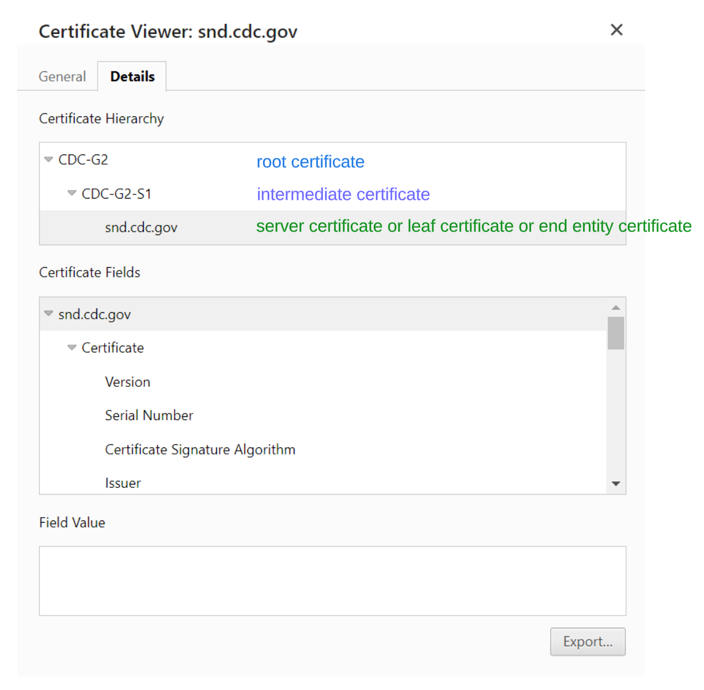
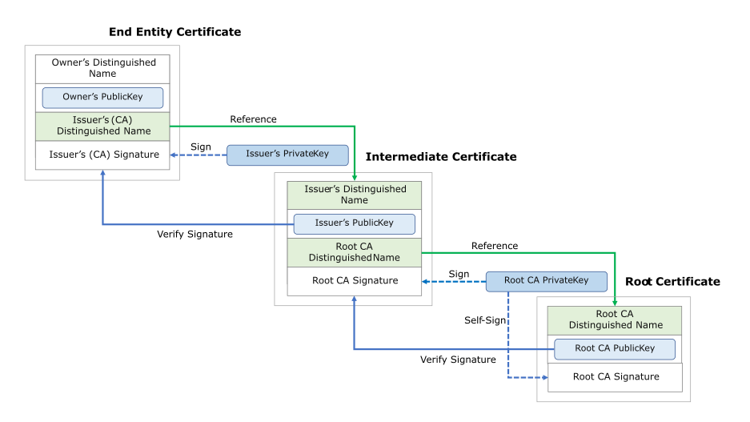

# Certificates for CDC

## Quick Access

1. [Linux - Operating System Certificate Store](#linux-based-systems)
1. [Ubuntu](#ubuntu)
1. [Redhat](#redhat)
1. [Python](#python)
1. [R](#r)
1. [Java](#java)
1. [Golang](#golang)
1. [NodeJS](#nodejs)
1. [Ruby](#ruby)
1. [Atlantis](#atlantis)
1. [Curl](#curl)
1. [Wget](#gnu-wget)
1. [Git](#git)

## Technical Usage

We manage [certificates as part of public key infrastructure](https://cheapsslsecurity.com/blog/what-are-root-certificates-and-intermediate-certificates/) to protect data and communication between a client and a server. A server presenting a certificate to the client will often include the root certificate, the intermediate certificate, and a leaf or server certificate.

The client, whether that is a library under a programming language (ex. python's request), or a browser (ex. Chrome, Firefox) will assert the validity of the server's identity based on what has been installed in its trust store to establish the certificate chain of trust. If it fails, the client normally cease the communication.



The song and dance of certificate validation starts at the end entity or the leaf certificate.



For most cases, [trusting just the root certificate](https://security.stackexchange.com/questions/83874/in-order-to-trust-the-digital-certificate-does-immediate-ca-cert-also-needs-to) is the absolute minimum for a client to properly connect to a server.

## Windows Operating System - Certificate Stores

The Windows Operating System includes several [certificate stores](https://learn.microsoft.com/en-us/dotnet/framework/configure-apps/file-schema/wcf/certificate-of-clientcertificate-element?redirectedfrom=MSDN) to store digital certificates in X.509 for different purposes. These certificates control what the typical CDC laptop trusts. The responsibility of modifying certificates falls under the responsibility of the OCIO Identity and Access Management branch (IAMB) and the [Active Directory](mailto:adhelpdsk@cdc.gov) team.

Without it, the laptop won't trust the self-signed certificates used by the number of intranet websites (ex. intranet.cdc.gov, git.cdc.gov) and certificates re-signed by intermediate firewall devices such as ZScaler and Palo Alto devices serving as a [transparent man-in-the-middle https proxy](https://docs.mitmproxy.org/stable/concepts-howmitmproxyworks/.#transparent-https).

| Certificate Storage    | Usage                                                               |
| ---------------------- | ------------------------------------------------------------------- |
| AddressBook            | Certificate store for other users.                                  |
| AuthRoot               | Certificate store for third-party certification authorities (CAs).  |
| CertificationAuthority | Certificate store for intermediate certification authorities (CAs). |
| Disallowed             | Certificate store for revoked certificates.                         |
| My                     | Certificate store for personal certificates.                        |
| Root                   | Certificate store for trusted root certification authorities (CAs). |
| TrustedPeople          | Certificate store for directly trusted people and resources.        |
| TrustedPublisher       | Certificate store for directly trusted publishers.                  |

## Usage

To download and use the [certificate bundles](../data/bundle/README.md) properly, we have to understand the type of clients we plan on using.

Operating Systems (ex. Windows, Ubuntu, Redhat) and programming language clients (ex. Python's requests library, Java's Keystore, wget, curl) may use different truststore in determining the validity of a server's certificate. Teams have to explicitly add these certificate bundles into the trust store that these clients are using to validate the chain of trust.

## Linux Based Systems

Based on [Golang's interpretation of root Linux setup](https://go.dev/src/crypto/x509/root_linux.go), we can find a number of places where the _default_ certificate authority bundles are. In addition to these certificate files, and paths to certificates, many distros prefer a dedicated location for new certificates authority to trust such as **/usr/local/share/ca-certificates** (ex. Ubuntu) or **/usr/share/ca-certificates** (ex. Ubuntu) or **/etc/pki/ca-trust/source/whitelist/** (ex. Redhat) or and a command line tool such as **update-ca-certificates** (ex. Ubuntu) or **update-ca-trust** (ex. Redhat) to update the operating system's certificates that it trusts. Examples can be found below for respective operating systems: [Ubuntu](#ubuntu), [Redhat](#redhat).

```bash
# certificate authority certificates to trust
"/etc/ssl/certs/ca-certificates.crt",                // Debian/Ubuntu/Gentoo etc.
"/etc/pki/tls/certs/ca-bundle.crt",                  // Fedora/RHEL 6
"/etc/ssl/ca-bundle.pem",                            // OpenSUSE
"/etc/pki/tls/cacert.pem",                           // OpenELEC
"/etc/pki/ca-trust/extracted/pem/tls-ca-bundle.pem", // CentOS/RHEL 7
"/etc/ssl/cert.pem",                                 // Alpine Linux

# locations where certificates may be
"/etc/ssl/certs",               // SLES10/SLES11, https://golang.org/issue/12139
"/system/etc/security/cacerts", // Android
"/usr/local/share/certs",       // FreeBSD
"/etc/pki/tls/certs",           // Fedora/RHEL
"/etc/openssl/certs",           // NetBSD
"/var/ssl/certs",               // AIX
```

### Ubuntu

> [!TIP]
> Ubuntu's [trust-store](https://ubuntu.com/server/docs/security-trust-store) requires the extension of the certificate bundle file to be .crt instead of .pem.

Assuming `min-cdc-bundle-ca.crt` to be the certificate, this script snippet will install the certificate bundle to the Ubuntu operating system's trust store.

```bash
sudo apt-get install -y ca-certificates
sudo cp min-cdc-bundle-ca.crt /usr/local/share/ca-certificates
sudo update-ca-certificates
```

### Redhat

[Redhat Enterprise Linux](https://www.redhat.com/sysadmin/configure-ca-trust-list) uses the [ca-certificates](https://wiki.mozilla.org/CA) - which is the Mozilla package by default. Assuming `min-cdc-bundle-ca.crt` to be the certificate, this script snippet will install the certificate bundle to the Redhat operating system's trust store.

```bash
sudo cp min-cdc-bundle-ca.crt /etc/pki/ca-trust/source/whitelist/
sudo update-ca-trust
```

### Python

There are a number of ways Python can work with a trust store.

- [Python 3.10 has an experimental trust store](https://stackoverflow.com/questions/39356413/how-to-add-a-custom-ca-root-certificate-to-the-ca-store-used-by-pip-in-windows)

#### Method 1: Set the Environment Variable (for Requests library only)

- For applications using the [requests](https://pypi.org/project/requests/) library in Python, with the certificate bundle called `min-cdc-bundle-ca.crt` in the example, we can set the environment variable: `REQUESTS_CA_BUNDLE` and `SSL_CERT_FILE` to the certificate bundle's path.

To set the environment variable prior to running an application, we can set it like this.

```bash
export REQUESTS_CA_BUNDLE='min-cdc-bundle-ca.crt'
export SSL_CERT_FILE='min-cdc-bundle-ca.crt'
```

To do this live in an application, we can set it this way.

```python
import os

os.environ["REQUESTS_CA_BUNDLE"] = 'min-cdc-bundle-ca.crt'
os.environ["SSL_CERT_FILE"] = 'min-cdc-bundle-ca.crt'
```

#### Method 2: Add the certificate bundle as part of the certifi certificate library

- For applications using the [certifi](https://pypi.org/project/certifi/) library in Python, it is possible to append to the certificate certifi once upon starting the application provided a certificate bundle called `min-cdc-bundle-ca.crt` in the example below.

```python
import Path
def update_cert():
  cafile = certifi.where()
  certPath = Path(__file__).parents[2].joinpath('min-cdc-bundle-ca.pem')
  print(certPath)
  with open(certPath, 'rb') as infile:
    customca = infile.read()
  with open(cafile, 'ab') as outfile:
    outfile.write(customca)
```

#### Method 3: Disable Certificate Verification for Python

> [!CAUTION]
> The use of this environment variable is strongly discouraged, as it disables certificate validation for TLS connections, meaning clients are blindly trusting the server certificates.

- Disabling client side validation of server certificate is frown upon, because the client missed a potentially critical opportunity to validate the identity of a server.

This small snippet provides a context manager to bypass SSL checks on a python client.

```python
@contextlib.contextmanager
def no_ssl_verification():
  opened_adapters = set()
  def merge_environment_settings(self, url, proxies, stream, verify, cert):
    # Verification happens only once per connection so we need to close
    # all the opened adapters once we're done. Otherwise, the effects of
    # verify=False persist beyond the end of this context manager.
    opened_adapters.add(self.get_adapter(url))
    settings = old_merge_environment_settings(self, url, proxies, stream, verify, cert)
    settings['verify'] = False
    return settings
  requests.Session.merge_environment_settings = merge_environment_settings
  try:
    with warnings.catch_warnings():
      warnings.simplefilter('ignore', InsecureRequestWarning)
      yield
  finally:
    requests.Session.merge_environment_settings = old_merge_environment_settings

    for adapter in opened_adapters:
      try:
        adapter.close()
      except:
        pass
```

Use the context manager by wrapping all network request / https calls around it using `with no_ssl_verification()`:

```python
with no_ssl_verification():
  c = AkamaiClient()
  s, contact_ids = c.connect(AkamaiConfig().credentials())
  if s is None or contact_ids is None or not contact_ids:
    print('Exiting: failed to get connection or contract IDs from Akamai.')
    sys.exit()
```

### R

Maintainers for the [R](https://www.r-project.org/) Language wraps libcurl into a library [RCurl](https://cran.r-project.org/web/packages/RCurl/index.html). As a result, we can trust a certificate authority bundle similar to [Curl](#curl).

#### Method 1: Set the Environment Variable (for RCurl library only)

To specify a certificate authority certificate file, we [set the environment variable **CURL_CA_BUNDLE**](https://curl.se/docs/sslcerts.html) to point to the certificate file. Assuming `/etc/ssl/certs/ca-certificates.crt` is the certificate file with all the certificates for curl to trust.

```bash
export CURL_CA_BUNDLE=/etc/ssl/certs/ca-certificates.crt
```

#### Method 2: Set Environment as part of R Session

Alternately, we can set it in the R script as part of an R session:

```r
Sys.setenv(CURL_CA_BUNDLE = "/etc/ssl/certs/ca-certificates.crt")
```

#### Method 3: Set each HTTPS Request with the configuration

Or if using the `httr` library for HTTPS client requests going to `https://www.google.com`, we have to set the parameters for each HTTP request.

```r
library(httr)
GET("https://www.google.com", config(cainfo = "/etc/ssl/certs/ca-certificates.crt"))
```

Or if we use the `curl` library for HTTPS client requests going to `https://www.google.com`, we can do the following:

```r
library(curl)
handle <- new_handle(cainfo = "/etc/ssl/certs/ca-certificates.crt")
curl_fetch_memory("https://www.google.com", handle = handle)
```

### Java

Java and Java Development Kit (JDK) has a certificate trust store called keystore and a command line tool called [keytool](https://docs.oracle.com/en/java/javase/17/docs/specs/man/keytool.html) to import single certificate at a time. Java applications and build tools such as [Maven](https://maven.apache.org/install.html) and [Gradle](https://gradle.org/install/) relies on the Java Development Kit (JDK)'s keystore instead of the operating system's certificate store by default.

By default, the keystore is in `$JAVA_HOME/jre/lib/security/cacerts` and the password is `changeit`.

The keystore can only take in a single certificate at a time; so this script from [stackoverflow](https://stackoverflow.com/a/29997111) can split our certificate bundles into individual certificates as inputs to the keystore.

```bash
#!/usr/bin/env bash
set -eu
PEM_FILE=$1
PASSWORD=$2 # This default keystore password for Java is changeit
KEYSTORE=$3
CERTS=$(grep -c 'END CERTIFICATE' "${PEM_FILE}")
for N in $(seq 0 $(("${CERTS}" - 1))); do
  ALIAS="${PEM_FILE%.*}-$N"
  cat "${PEM_FILE}" |
    awk "n==$N { print }; /END CERTIFICATE/ { n++ }" |
    keytool -noprompt -import -trustcacerts \
      -alias "${ALIAS}" -keystore "${KEYSTORE}" -storepass "${PASSWORD}"
done
```

We run this script, assuming `min-cdc-bundle-ca.crt` as the certificate and `keytool-export.sh` as the bash script name.

```bash
bash keytool-export.sh min-cdc-bundle-ca.crt changeit "${JAVA_HOME}/jre/lib/security/cacerts"
```

#### Adding a Leaf Certificate

> [!CAUTION]
> Use this method sparringly, and only as a method for a break fix! The webserver should fix the presenting certificate.

Browsers and HTTP clients from various programming languages behave differently to complete the certificate chain of trust. When a user accesses a website using a browser and receives an incomplete certificate from the web server that does not include the certificate chain of trust, the browser has the option to use the certificates it has or seek help from another source to complete the chain of trust. HTTP clients rarely do this, and will fail immediately.

Thus, sometimes “it works on my browser, but my Java client is failing”. This means that the web server is not presenting all the certificates for the client to establish a chain of trust, and whomever owns the server will need to fix the certificate being presented.

When we explicitly want to trust a leaf certificate, bypassing the full certificate chain of trust, we can execute the following command to accept the leaf certificate - in this case, we add the leaf certificate for `swa.cdc.gov` to the Java Keystore as a trusted certificate authority.

```bash
SERVERNAME="swa.cdc.gov"
echo | openssl s_client -servername "$SERVERNAME" -connect "$SERVERNAME:443" 2>&1 | sed -ne '/-BEGIN CERTIFICATE-/,/-END CERTIFICATE-/p' > cert.pem && \
  "${FORTIFY_EXEC_FOLDER}"/jre/bin/keytool -importcert -alias cdc-swa -noprompt -cacerts -storepass changeit -file cert.pem
```

### Golang

[Golang](https://go.dev/) utilizes the [operating system's trusted certificates at a default location](https://go.dev/src/crypto/x509/root_linux.go). As long as the operating system has the certificates it needs to trust, Golang as a client is good to go.

### NodeJS

[NodeJS] prebundles its own certificate truststore [on a default list of certificate](https://github.com/nodejs/node/blob/main/src/node_root_certs.h) it trusts for its [TLS SecureContext](https://github.com/nodejs/node/issues/27079) core library. There are a number of ways to add custom certificate authorities to the truststore.

> [!NOTE]
> Pick only one of these methods to use at a time, as these methods override each other according to [NodeJS documentation](https://nodejs.org/api/cli.html).

#### Method 1: Use the Operating System's Truststore

To tell NodeJS, npm, and yarn to use the the operating system's truststore, set the environment variable [**NODE_OPTIONS** to `--use-openssl-ca`](https://nodejs.org/api/cli.html#node_optionsoptions):

```bash
export NODE_OPTIONS='--use-openssl-ca'
```

Using the **NODE_OPTIONS** environment variable is equivalent to running the `node` command line tool with the flag `--use-openssl-ca`.

```bash
node --use-openssl-ca
```

#### Method 2: Add New Trusted Certificates

To add _additional_ certificates that NodeJS, npm, and yarn needs to trust, use the **NODE_EXTRA_CA_CERTS** environment variable to point to the path of a certificate file.

For example, if the certificate file is located at `/opt/certs/min-cdc-bundle-ca.crt`, then the environment variable should be set as follows:

```bash
export NODE_EXTRA_CA_CERTS='opt/certs/min-cdc-bundle-ca.crt'
```

#### Method 3: Disable Certificate Verification For NodeJS

> [!CAUTION]
> The use of this environment variable is strongly discouraged, as it disables certificate validation for TLS connections, meaning clients are blindly trusting the server certificates.

To turn off certificate validation for a TLS and HTTPS connection, set the environment variable [**NODE_TLS_REJECT_UNAUTHORIZED**](https://nodejs.org/api/cli.html#node_tls_reject_unauthorizedvalue) to '0'.

```bash
export NODE_TLS_REJECT_UNAUTHORIZED='0'
```

### Ruby

[Ruby](https://www.ruby-lang.org/en/) uses [OpenSSL](https://github.com/ruby/openssl) by default.

If the certificate file is located at `/opt/certs/min-cdc-bundle-ca.crt`, then we can set the environment variable as follows:

```bash
export SSL_CERT_FILE='opt/certs/min-cdc-bundle-ca.crt'
```

### Atlantis

[Atlantis](https://runatlantis.io) is a golang application that centralizes Terraform infrastructure-as-code deployment. By default, it'll [trust the operating system's certificate store](https://github.com/cdcent/cdc-coe-atlantis/blob/main/data-exchange/infra/Dockerfile#L23-L24) for a certificate file with the list of trusted certificate authorities.

### Curl

[Curl](https://curl.se/book.html) expects the certificate bundle with multiple certificates to be in a .pem file. Assuming `min-cdc-bundle-ca.crt` is the name of the certificate bundle, curl can take in a --cacert parameter to trust all the certificates needed.

```bash
curl -vvv --cacert min-cdc-bundle-ca.crt https://google.com
```

Additional, curl allows specifying your own certificate authority certificate file by [setting the environment variable **CURL_CA_BUNDLE**](https://curl.se/docs/sslcerts.html) to point to the certificate file. Assuming `/etc/ssl/certs/ca-certificates.crt` is the certificate file with all the certificates for curl to trust.

```bash
export CURL_CA_BUNDLE=/etc/ssl/certs/ca-certificates.crt
curl -vvv https://google.com
```

The **export** command for environment variables is often placed in the **~/.bashrc** file so that a terminal will start with environment variable set.

### GNU Wget

[GNU Wget](https://www.gnu.org/software/wget/) relies on distribution target each of the major operating systems (Windows/MacOS/Linux) to specify the operating system's trusted certificate directory. It is also possible to specify the location as an argument, assuming `min-cdc-bundle-ca-crt` is the certificate file of a bundle of certificate authorities, we can run the following to reach google.com.

```bash
wget -vvv ----ca-certificate=min-cdc-bundle-ca.crt https://google.com
```

Alternatively, we need to find the `~/.wgetrc`, `.wgetrc` or `/etc/wgetrc` file where the distribution's configuration may be set.

For [Ubuntu 24.04](https://github.com/cdcent/ocio-wsl/blob/main/Dockerfile#L64), the configuration in the wgetrc file uses **/usr/lib/ssl/cert.pem** as the location of the certificate bundle to trust.

### Git

When using a [Git](https://git-scm.com/downloads) based client with HTTPS to communicate with a Git server such as [github.com](https://github.com/cdcgov) or [git.cdc.gov](https://git.cdc.gov), provided **/etc/ssl/certs/ca-certificates.crt** is the location of the the trusted certificate authorities, we configure Git to trust the certificate authority as follows:

```bash
git config --global http.sslcainfo /etc/ssl/certs/ca-certificates.crt
```

> [!TIP]
> Alternatively, using SSH instead of HTTPs to get to the Git server will not require this as firewalls cannot intercept SSH traffic in the same manner.

## Website for Testing

- [badssl.com](https://badssl.com) - [chromium badssl.com](https://github.com/chromium/badssl.com) was started by a number of browser engineers to test certificates.

## Additional Reading

- For further Public Key Infrastructure (PKI) technical details, read this [technical blog from smallstep](https://smallstep.com/blog/everything-pki/).
